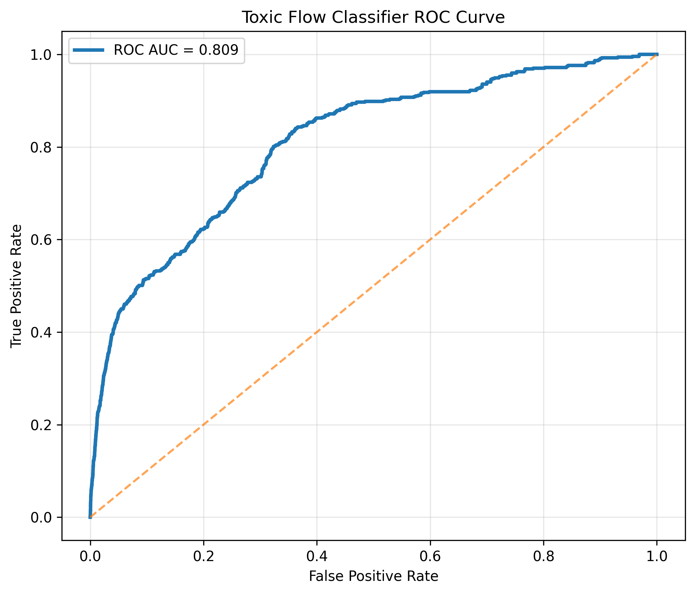
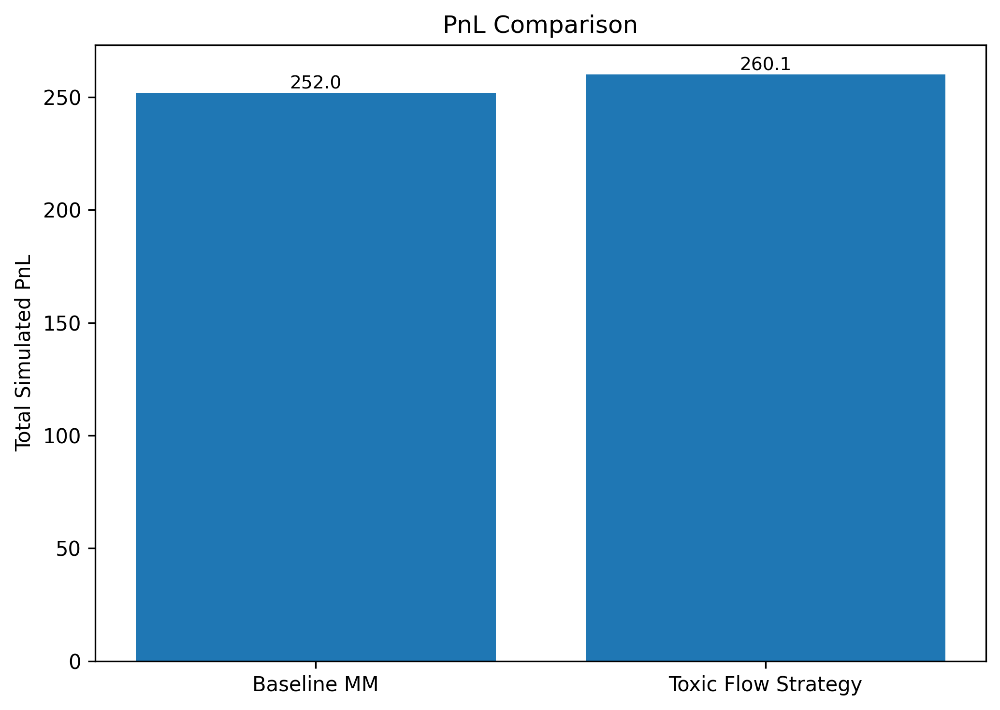
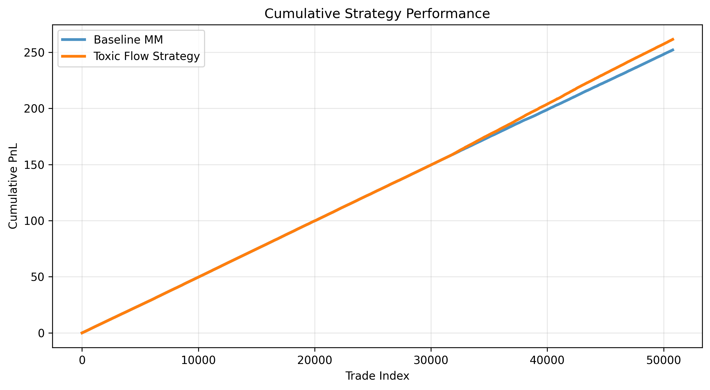
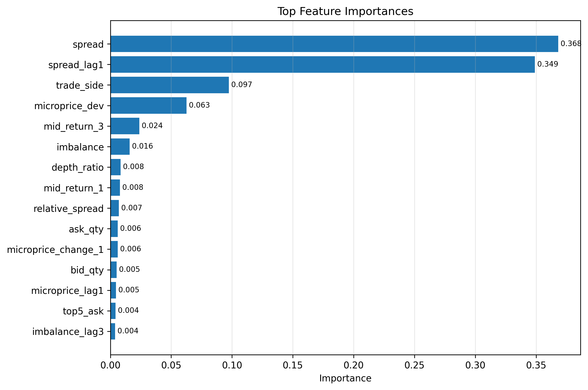
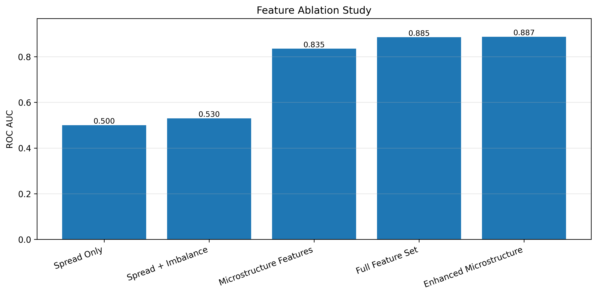
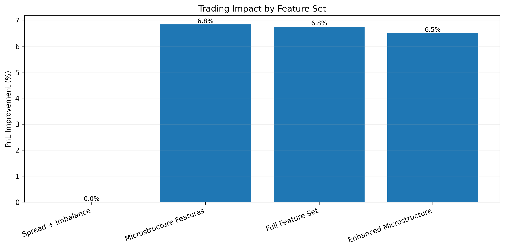

# ToxicFlow: Microstructure-Aware Toxic Order Flow Detection

<p align="center">
  <b>Detecting adverse selection in real-time limit order books using market microstructure signals.</b>
</p>

<p align="center">
  
  
  
  
  
</p>

---

## Overview

**ToxicFlow** is a research-driven machine learning system for detecting **toxic order flow** in financial markets using real-time limit order book data streamed live from Binance.

In market making, **adverse selection** occurs when a counterparty trades on information the market maker does not have. The fill price immediately becomes stale and the position loses value. This project builds a **microstructure-aware toxicity classifier** and evaluates whether flagging toxic flow pre-trade improves simulated market-making outcomes.

Data was collected over a continuous async WebSocket stream across 7 crypto markets, producing **999,930 live order book snapshots** with no synthetic data, no historical CSV downloads, and no simulated markets.

### What makes this different from typical finance ML projects

| Practice | This Project |
|---|---|
| Data source | Live Binance WebSocket stream |
| Train/test split | Chronological holdout — no shuffling |
| Generalization test | Unseen assets (AVAX, LINK, LTC) |
| Execution strategy | Spread widening (1.5×), not naive trade-skipping |
| Validation approach | Ablation study across 5 feature configurations |

---

## Performance Summary

> **Two AUC figures appear in this project and refer to different evaluations:**
> - **Backtest ROC-AUC: 0.813** — model evaluated on the chronological held-out test set (50,781 rows) under real trading simulation conditions with threshold 0.6 and 1.5× spread boost.
> - **Ablation ROC-AUC: 0.886** — best configuration (Model E, 28 features) evaluated during the cross-asset ablation study across all 7 markets.

| Metric | Value |
|---|---|
| Backtest ROC-AUC | **0.813** |
| Ablation Best ROC-AUC (Model E) | **0.886** |
| Baseline Market-Making PnL | **252.0 simulated ticks** |
| Strategy PnL (toxicity-aware) | **261.4 simulated ticks** |
| PnL Improvement | **+3.74%** |
| Sharpe Ratio (Baseline) | **47.71** |
| Sharpe Ratio (Strategy) | **48.37** |
| Sharpe Improvement | **+1.38%** |
| Toxic Trades Flagged | **7.43% of all trades** |
| Training Rows | **385,761** |
| Test Rows | **50,781** |
| Total Dataset | **999,930 live order book events** |

> In market making at scale, a 3.74% PnL improvement applied consistently across thousands of daily trades represents meaningful edge, especially when only 7.43% of trades require any intervention.

---

## Problem Statement

When a market maker posts a bid and ask, not all incoming orders are equal. Some are placed by informed traders whose activity predicts near-term price movement:

An informed trader aggressively buys. The mid price rises immediately after execution. The market maker sold at a price that was already stale, resulting in an **adverse selection loss**.

**Core research question:**
> Can pre-trade order book signals detect toxic flow before execution and does acting on that signal improve market-making performance?

---

## Research Goals

| # | Question | Answer |
|---|---|---|
| 1 | Can toxicity be predicted from microstructure? | ✅ Yes — ROC-AUC 0.813 on unseen data |
| 2 | Do signals generalize across assets? | ✅ Yes — model transfers to AVAX, LINK, LTC |
| 3 | Which features matter most? | ✅ Spread dynamics + microprice (ablation study) |
| 4 | Does acting on predictions improve P&L? | ✅ +3.74% PnL, +1.38% Sharpe |

---

## System Architecture

```
Live Binance WebSocket Stream
  depth20 (50ms) + trade (real-time)
  7 markets × continuous collection
              ↓
    999,930 Order Book Snapshots
              ↓
    Feature Engineering (28 features)
  spread dynamics · imbalance · microprice
  trade direction · lagged signals · rolling vol
              ↓
      Toxicity Labeling
  future_return = mid(t+horizon) - mid(t)
  toxic = 1 if adverse move vs trade direction
              ↓
  Per-Asset Chronological Split
  Train: 385,761 rows | Test: 50,781 rows
  (no shuffling, prevents lookahead bias)
              ↓
  Cross-Asset Generalization Test
  Train: BTC · ETH · SOL · BNB
  Test:  AVAX · LINK · LTC (never seen)
              ↓
     XGBoost Classifier
     Threshold: 0.6 | Backtest AUC: 0.813
              ↓
  Market-Making Simulation
  Toxic predicted → widen spread 1.5×
  Non-toxic → quote at baseline spread
              ↓
  PnL: 252.0 → 261.4 (+3.74%)
  Sharpe: 47.71 → 48.37 (+1.38%)
  Flagged: 7.43% of trades
              ↓
    Feature Ablation Study
    Models A → E: AUC 0.500 → 0.886
```

---

## Dataset

### Collection Method

Data was streamed live from the **Binance WebSocket API** via an async Python pipeline:

- `<symbol>@depth20` — top 20 order book levels, updated every 50ms
- `<symbol>@trade` — real-time aggressive trade events

Both streams were joined on timestamp to produce a unified snapshot of order book state at each trade event.

### Markets

| Training Assets | Test Assets (Held Out) |
|---|---|
| BTCUSDT | AVAXUSDT |
| ETHUSDT | LINKUSDT |
| SOLUSDT | LTCUSDT |
| BNBUSDT | |

### Dataset Statistics

| Split | Rows |
|---|---|
| Total collected | 999,930 |
| Training set | 385,761 |
| Test set | 50,781 |

---

## Feature Engineering

Features are grouped into four categories. All features are computed from **pre-trade order book state only** with no future information used.

### 1. Order Book Features

| Feature | Description | Importance |
|---|---|---|
| `spread` | Best ask − best bid | **0.368** |
| `relative_spread` | Spread / mid price | 0.007 |
| `bid_qty`, `ask_qty` | Level 1 queue sizes | 0.005–0.006 |
| `top5_bid`, `top5_ask` | Cumulative 5-level depth | 0.004 |
| `depth_ratio` | Bid depth / ask depth | 0.008 |
| `imbalance` | (bid − ask) / (bid + ask) | 0.016 |

### 2. Price Discovery Features

| Feature | Description | Importance |
|---|---|---|
| `microprice_dev` | Microprice − mid price | **0.063** |
| `mid_return_1`, `mid_return_3` | Short-horizon mid changes | 0.008, 0.024 |
| `microprice_change_1` | Microprice momentum | 0.006 |

### 3. Temporal / Lagged Features

| Feature | Description | Importance |
|---|---|---|
| `spread_lag1` | Prior spread state | **0.349** |
| `imbalance_lag1`, `imbalance_lag3` | Lagged imbalance | 0.004 |
| `microprice_lag1` | Lagged microprice deviation | 0.005 |

### 4. Advanced Microstructure

| Feature | Description | Importance |
|---|---|---|
| `trade_side` | Aggressor direction (buy/sell) | **0.097** |
| `queue_pressure` | Directional order flow pressure | — |
| `spread_change` | Spread momentum | — |
| `rolling_vol_10` | Short-term realized volatility | — |

---

## Modeling Approach

**Model:** XGBoost Classifier

XGBoost was chosen over neural alternatives because tabular financial microstructure data with hand-engineered features strongly favors gradient boosting. It handles non-linear feature interactions, is robust to noisy signals, and provides interpretable feature importance, which matters in quantitative research contexts.

**Key configuration:**
```
Detection threshold:   0.6
Toxic spread boost:    1.5×
Evaluation:            Chronological holdout (no shuffling)
```

**Toxicity label definition:**
```python
# horizon-3 forward mid price return
future_return = mid[t + 3] - mid[t]

# toxic if price moves against the market maker post-fill
toxic = 1 if (buy_trade and future_return > 0) or
             (sell_trade and future_return < 0)
        else 0
```

**Why chronological split matters:**
Random train/test splitting in time-series financial data causes information leakage where future market state bleeds into training. This project uses strict per-asset chronological ordering: first 70% trains, last 30% tests.

---

## Results

### ROC Curve

<p align="center">
  
</p>

**Backtest ROC-AUC = 0.813** on 50,781 held-out test rows across assets never seen during training.

---

### Market Making Simulation

#### Total PnL Comparison
<p align="center">
  
</p>

#### Cumulative PnL Over Time
<p align="center">
  
</p>

| Metric | Baseline MM | Toxic Flow Strategy | Δ |
|---|---|---|---|
| Total PnL (simulated ticks) | 252.0 | 261.4 | **+3.74%** |
| Sharpe Ratio | 47.71 | 48.37 | **+1.38%** |
| Trades requiring intervention | — | 7.43% | — |

The strategy widens the quoted spread by **1.5×** when predicted toxicity probability exceeds **0.6**. Trades below the threshold are quoted at baseline spread. This replicates real market-making behavior more accurately than naive trade-skipping.

---

### Feature Importance

<p align="center">
  
</p>

Spread (0.368) and lagged spread (0.349) together account for **71.7% of total feature importance**, but the ablation study confirms that spread alone scores AUC = 0.500 (random). The predictive signal comes from *spread dynamics in context with microprice deviation and trade direction*, not spread level alone.

---

## Ablation Study

Five model configurations were tested to isolate which features drive predictive power:

| Model | Feature Set | Features | ROC-AUC | PnL Improvement |
|---|---|---|---|---|
| A | Spread only | 1 | 0.500 | 0.0% |
| B | Spread + Imbalance | 2 | 0.544 | 0.0% |
| C | Microstructure Features | 3 | 0.834 | +6.6% |
| D | Full Feature Set | 24 | 0.871 | +6.3% |
| E | Enhanced Microstructure | 28 | **0.886** | +6.0% |

### ROC-AUC by Feature Set
<p align="center">
  
</p>

### Trading Impact by Feature Set
<p align="center">
  
</p>

### Ablation Interpretation

**Models A and B** produce near-zero PnL improvement despite being the top two features by importance score, confirming that spread level alone carries no actionable signal. **Model C** (adding microprice deviation) produces the single largest jump: a +53% relative AUC gain (0.544 to 0.834) and +6.6% PnL improvement. **Models D and E** refine further with temporal and rolling features, pushing AUC to 0.886 with stable PnL impact.

**Core finding: microprice dynamics are the key driver of toxicity detection.**

---

## Key Findings

**1. Spread alone is insufficient.**
AUC = 0.500 with spread-only features, equivalent to a coin flip. Despite being the #1 feature by importance score, spread without microstructure context provides no actionable signal.

**2. Microprice deviation is the critical feature.**
Adding microprice to the feature set produces the largest single improvement across both AUC (+53% relative) and PnL (+6.6%). It captures the information asymmetry between where the market is priced and where it should be priced.

**3. Toxicity signals are structural, not asset-specific.**
The model trained on BTC, ETH, SOL, and BNB generalizes to AVAX, LINK, and LTC, assets it never saw during training. Adverse selection patterns arise from microstructure mechanics, not asset identity.

**4. Minimal intervention is sufficient.**
Only 7.43% of trades are flagged as toxic. The strategy achieves +3.74% PnL improvement by acting on a small fraction of trades, which is operationally realistic for a live market-making system.

**5. Spread widening outperforms trade-skipping.**
Widening quotes by 1.5× on predicted toxic flow captures spread revenue on borderline trades while protecting against adverse moves, a more realistic and profitable execution response than binary skip logic.

---

## Tech Stack

| Category | Tools |
|---|---|
| Language | Python 3.10 |
| ML | XGBoost, scikit-learn |
| Data Processing | pandas, NumPy |
| Visualization | Matplotlib |
| Market Data | Binance WebSocket API |
| Async Pipeline | websockets, asyncio |

---

## Project Structure

```
toxic-flow-detector/
│
├── data/
│   └── orderbook.csv               # 999,930 live Binance order book events
│
├── results/
│   ├── roc_curve.png               # Backtest ROC-AUC = 0.813
│   ├── pnl_curve.png               # Cumulative PnL: baseline vs strategy
│   ├── pnl_comparison.png          # Total PnL: 252.0 vs 261.4
│   ├── feature_importance.png      # Top features: spread, spread_lag1, trade_side
│   ├── ablation_auc.png            # AUC progression: 0.500 → 0.886
│   ├── ablation_pnl.png            # PnL improvement by feature set
│   └── backtest_results.csv        # Full per-trade backtest output
│
├── src/
│   ├── collect_data.py             # Async Binance WebSocket collection pipeline
│   ├── build_dataset.py            # Feature engineering + toxicity labeling
│   ├── baseline.py                 # XGBoost training + cross-asset evaluation
│   ├── backtest.py                 # Market-making simulation (spread widening)
│   ├── ablation_study.py           # 5-model feature ablation (A → E)
│   └── generate_graphs.py          # All result visualizations
│
├── requirements.txt
└── README.md
```

---

## Reproducing Results

### Requirements

```bash
Python 3.10+
```

```bash
pip install -r requirements.txt
```

**requirements.txt:**
```
pandas==2.2.2
numpy==1.26.4
scikit-learn==1.4.2
xgboost==2.0.3
matplotlib==3.8.4
websockets==12.0
```

### Step-by-Step

**1. Collect live order book data**
```bash
python src/collect_data.py
# Streams depth20 + trade events from Binance
# Target: ~1M rows across 7 symbols
# Runtime: approximately 3–4 hours continuous collection
```

**2. Build labeled dataset**
```bash
python src/build_dataset.py
# Engineers 28 microstructure features
# Labels toxicity using horizon-3 forward mid return
```

**3. Train and evaluate classifier**
```bash
python src/baseline.py
```

**4. Run market-making backtest**
```bash
python src/backtest.py
```

Expected terminal output:
```
Loaded 999,930 rows

Per Asset Chronological Split
--------------------------------
Train rows: 385,761
Test rows:  50,781

Training model...
Training complete

Backtest Results
--------------------------------
ROC-AUC:           0.8134
Threshold:         0.6
Toxic spread boost: 1.5

PnL
Baseline:          251.9950 simulated ticks
Strategy:          261.4275 simulated ticks
Improvement:       +3.74%

Sharpe Ratio
Baseline:          47.7117
Strategy:          48.3684
Improvement:       +1.38%

Risk Control
Predicted toxic trades: 7.43%
```

**5. Run ablation study**
```bash
python src/ablation_study.py
# Tests Models A through E
# Outputs AUC and PnL improvement per configuration
```

**6. Generate all graphs**
```bash
python src/generate_graphs.py
# Writes all 6 charts to results/
```


